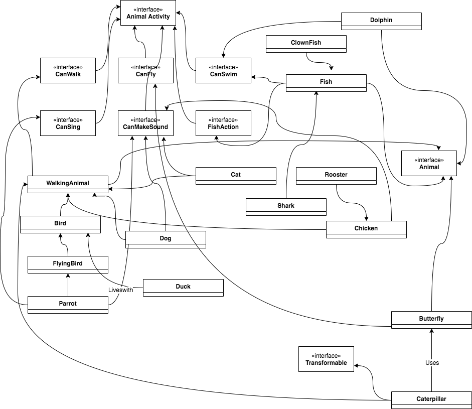

# singtel.interview.exercise

Run `./execute.sh` command to compile, run tests and run the application

### REST Endpoints are:
- GET `/animals` - Return all the animal types
- GET `/animals/{type}` - Return all the animal types who can do the given activity type
- GET `/animals/{activity}/count` Return the count of animals who can do the given activity type

#### Activity types
- fly
- walk
- swim
- sing 
- talk
 
### 